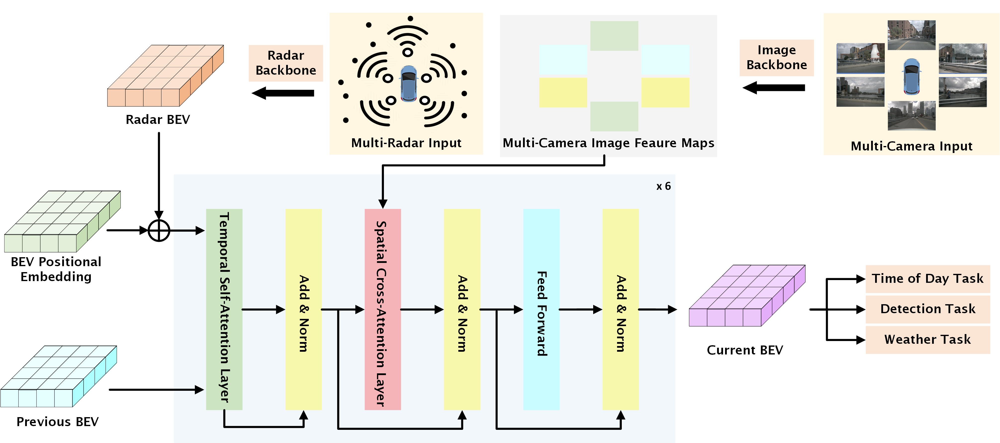
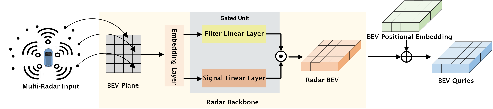

<div align="left">

# Radar Enlighten the Dark: Enhancing Low-Visibility Perception for Automated Vehicles with Camera-Radar Fusion

</div>

<!-- PROJECT SHIELDS -->
<div align="center">

[](https://github.com/pre-commit/pre-commit)
[](https://pytorch.org/get-started/locally/)
[](https://codecov.io/gh/PurdueDigitalTwin/REDFormer) <br>
[](https://github.com/PurdueDigitalTwin/REDFormer/blob/master/LICENSE)
[](https://github.com/PurdueDigitalTwin/REDFormer/pulls)
[](https://github.com/PurdueDigitalTwin/REDFormer/graphs/contributors)

</div>

<!-- PROJECT ILLUSTRATIONS -->
<br />
<div align="center">
    <p align="center">
        
    </p>
    <p align="center">
        
    </p>
</div>

---

## Table of Contents

- [Radar Enlighten the Dark: Enhancing Low-Visibility Perception for Automated Vehicles with Camera-Radar Fusion](#radar-enlighten-the-dark-enhancing-low-visibility-perception-for-automated-vehicles-with-camera-radar-fusion)
  - [Table of Contents](#table-of-contents)
  - [About](#about)
  - [Getting Started](#getting-started)
    - [Installation](#installation)
    - [Data Preparation](#data-preparation)
    - [Training](#training)
    - [Test](#test)
  - [Citatation](#citatation)
  - [License](#license)
  - [Acknowledgement](#acknowledgement)

---

## About

In this work, we propose a novel transformer-based  3D object detection model ``REDFormer'' to tackle low visibility conditions, exploiting the power of a more practical and cost-effective solution by leveraging bird's-eye-view camera-radar fusion. Using the nuScenes dataset with multi-radar point clouds, weather information, and time-of-day data, our model outperforms state-of-the-art (SOTA) models on classification and detection accuracy. Finally, we provide extensive ablation studies of each model component on their contributions to address the above-mentioned challenges. Particularly, it is shown in the experiments that our model achieves a significant performance improvement over the baseline model in low-visibility scenarios, specifically exhibiting a **31.31%** increase in rainy scenes and a **46.99%** enhancement in nighttime scenes.

---

## Getting Started

### Installation

Please refer to our [installation guide](docs/installation.md) for details.

### Data Preparation

### Training

### Test

---

## Citatation

If you find REDFormer usefule, you are highly encouraged to cite our paper:

```bibtex
```

---

## License

Distributed under the MIT License. See [`LICENSE`](LICENSE) for more information.

---

## Acknowledgement

We attribute our work to the following inspiring open source projects:

- [BEVFormer](https://github.com/fundamentalvision/BEVFormer)
- [mmdetetection3d](https://github.com/open-mmlab/mmdetection3d)
